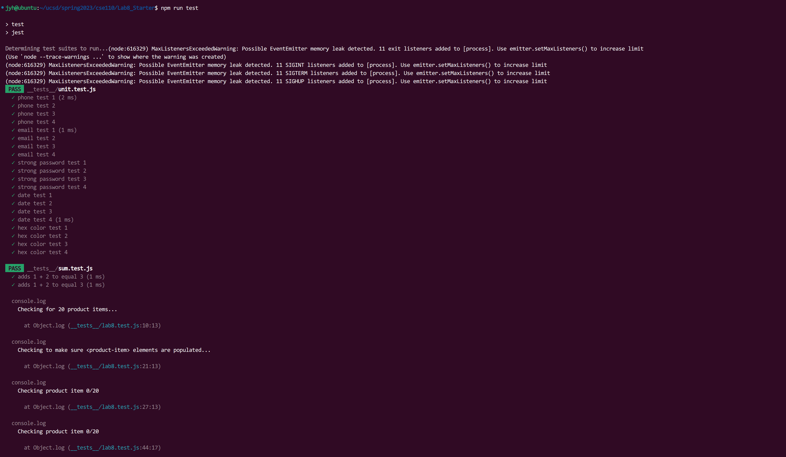

# Lab 8 - Starter

1. I will put these tests in github actions, that is, each push is automatically executed. Because this can find problems in the early stage of development, specific to each push. At the same time, the test results in github actions are visible to all developers, which is also convenient for other developers to carry out subsequent development and testing. Finally, this saves time and facilitates simultaneous development by multiple people, as the test units can be updated while the code is being developed.

2. No. E2E testing mainly tests whether the user's operation and input meet expectations, and unit testing should be used to test smaller units (functions).

3. No. As part2's introduces the cons of unit testing: unit test cannot test how these individual components interact with each other on an application/feature level. The "message" feature looks like a complex function that requires multiple components to work at the same time, and this feature also needs to test user behavior, e2e testing is a better choice.

4. Yes. The "max message length" function is a very specific function, which may be implemented by one or several functions. This is in line with the purpose of unit testing, and this feature has little to do with user behavior, unit testing is better than e2e testing.

